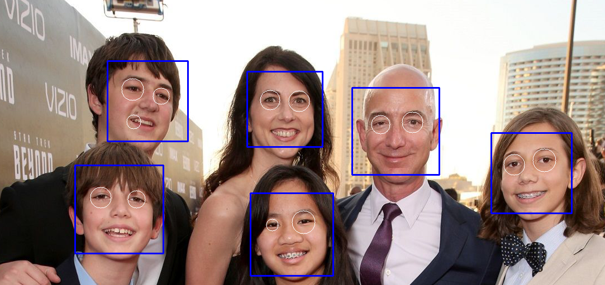
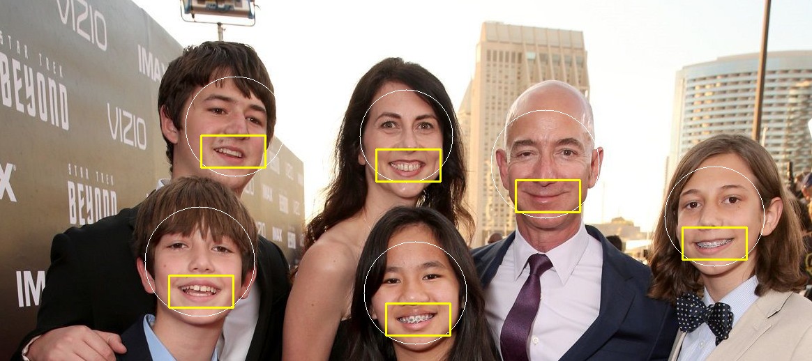

# Face-Detection-using-OpenCV-and-Python
A simple project to detect Face, eyes and smile using Haar cascade classifier.

# Requirements
1) OpenCV:opencv-4.4.0 
2) Python 3: python 3.8.5
3) Spyder Anaconda IDE (Optional)
4) Haar Cascade Classifier Files

Here i will share some of my outputs
# Face Detection using local image file

# Face Detection using video/web camera

# Face & Smile Detection using local image file

